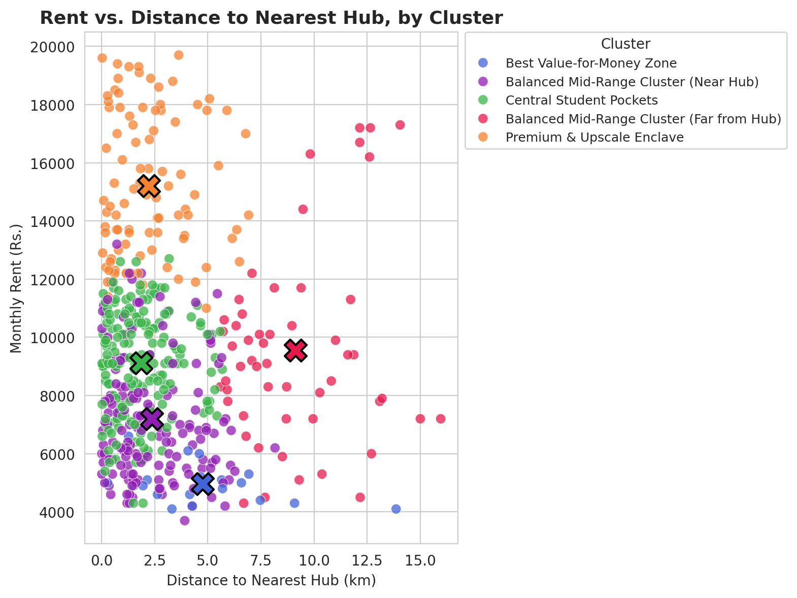
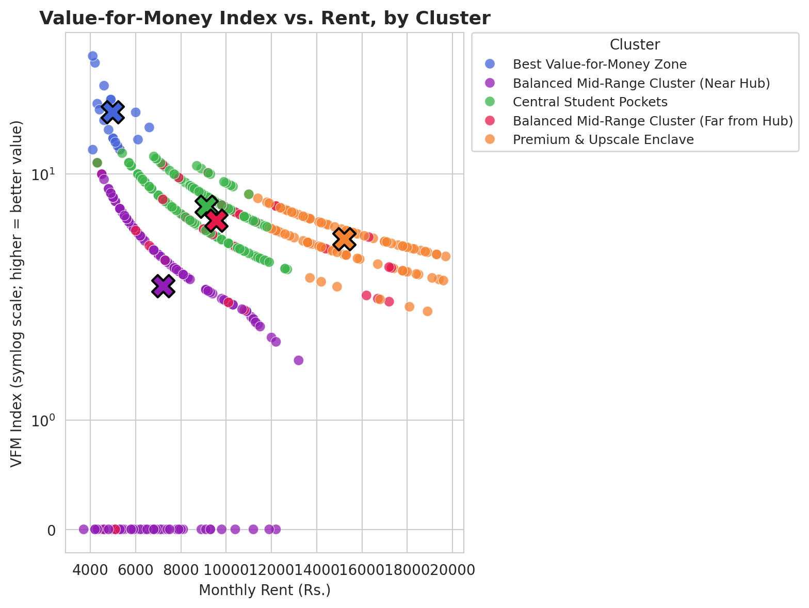

# Geolocational Analysis & Student Housing Recommendation in Jaipur using K-Means Clustering

[](https://rohanjoshi7.github.io/jaipur-student-housing-ml/assets/jaipur_housing_map.html)

# Geolocational Analysis & Student Housing Recommendation in Jaipur using K-Means Clustering

## Project Overview & Objectives
Finding the right accommodation is one of the biggest challenges for university students. This project aims to simplify that process for students in Jaipur—particularly those studying near major educational hubs like MNIT on JLN Marg or Malviya Nagar. 

By leveraging spatial data and machine learning, this pipeline classifies and recommends student housing based on three critical pillars: **budget constraints**, **proximity to campus**, and **essential amenities**. The goal is to replace tedious manual searching with a data-driven recommendation engine that balances commute times with optimal living standards.

## Key Innovations & Feature Engineering
Standard housing datasets often rely purely on rent prices, which fail to reflect the true cost or value for a student. This project introduces two key engineered features:

*   **Value-for-Money (VFM) Index:** A custom composite score calculated by dividing the total count of available amenities (e.g., Wi-Fi, AC, meals, laundry) by the normalized monthly rent. This provides the model with a direct "bang-for-your-buck" signal.
*   **Haversine Proximity Calculations:** Instead of relying on generic neighborhood names, the pipeline uses the Haversine formula to compute precise straight-line spatial distances (in kilometers) from latitude and longitude coordinates to central educational hubs.

## Machine Learning Pipeline
The core of this engine is an unsupervised learning pipeline utilizing K-Means clustering to segment the housing market.

*   **Data Scaling:** Applied `StandardScaler` to ensure continuous variables (rent, Haversine distance, and amenity scores) contribute equally to the distance matrix without magnitude bias.
*   **Optimization ($K=5$):** The optimal number of clusters was determined using both the **Elbow Method** (mapping inertia/within-cluster sum of squares) and **Silhouette Analysis**. Both metrics converged on $K=5$ as the ideal grouping.
*   **Cluster Profiling:** The resulting 5 clusters categorize the Jaipur student housing market into distinct, actionable personas:
    *   Balanced Mid-Range Clusters
    *   Central Student Pockets
    *   Best Value-for-Money Zones
    *   Premium & Upscale Enclaves

## Visualizations & Deliverables
The project includes visual profiles to analyze how the market segments across different financial and spatial constraints.

### Rent vs. Distance by Cluster

*Displays how housing clusters distribute when comparing monthly rent against the commute distance to key university hubs.*

### Value-for-Money vs. Rent

*Highlights the accommodations offering the highest amenity density relative to their price point.*

### Interactive Geospatial Map
An interactive Folium map (`Jaipur housing map.html`) is included in the `/assets` directory. It plots all evaluated accommodations across Jaipur, color-coded by their designated cluster, featuring interactive popups detailing rent, distance, and top amenities.

## How To Run

**1. Clone the repository:**
```bash
git clone https://github.com/rohanjoshi7/jaipur-student-housing-ml.git
cd jaipur-student-housing-ml

